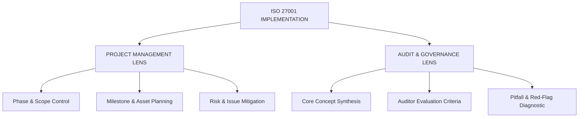

```markdown
# ISO/IEC 27001 Implementation & ISMS Governance Framework

## Overview & Purpose

This repository serves as a practical workspace, technical reference guide, and implementation portfolio for establishing, operating, and evaluating an Information Security Management System (ISMS) based on **ISO/IEC 27001:2022** and **ISO/IEC 27002:2022**.

Rather than viewing ISO 27001 purely through an academic or audit-only lens, this repository approaches ISMS deployment as a structured, end-to-end corporate initiative. By combining **Project Management Principles** with **Information Security Governance**, this workspace demonstrates how to systematically move an organization from business case validation to formal certification readiness.

---

## Strategic Methodology: The Dual-Lens Framework

Every module in this repository is analyzed and documented using a combined **Project Management** and **Audit-Diagnostic** approach:



### Framework Breakdown

| Dimension | Primary Focus | Key Operational Objectives |
| --- | --- | --- |
| **Project Management Lens** | Delivery & Project Lifecycle | • Phase & Scope Control<br>

<br>• Milestone & Asset Planning<br>

<br>• Risk & Issue Mitigation |
| **Audit & Governance Lens** | Quality & Compliance Quality | • Core Concept Synthesis<br>

<br>• Auditor Evaluation Criteria<br>

<br>• Pitfall & Red-Flag Diagnostic |

#### 1. Project Management Perspective (Delivery)

An ISMS implementation is a major business project. Content is structured into five sequential phases—**Initiation**, **Planning**, **Execution**, **Monitoring & Controlling**, and **Closing**—ensuring clear milestone tracking, scope boundary management, and risk mitigation throughout the project lifecycle.

#### 2. Audit & Governance Perspective (Quality & Compliance)

To ensure the output withstands third-party assessment, each topic is evaluated against three core diagnostic dimensions:

* **Core Concept & Requirement Synthesis:** In-depth, original explanations of ISO clause expectations and governance mechanisms.
* **Audit Evaluation Lens:** Key questions, evidence expectations, and diagnostic tests used by auditors to verify control and process integrity.
* **Implementation Pitfalls & Common Mistakes:** Early identification of operational anti-patterns, broken feedback loops, and failure modes to avoid during deployment.

---

## Standard & Framework Alignment

* **ISO/IEC 27001:2022** — Information Security Management Systems (Requirements)
* **ISO/IEC 27002:2022** — Information Security Controls (Guidance)

---

## Repository Structure & Project Lifecycle Mapping

```plaintext
ISO27001/
├── 01-Initiation/               # Business Case, Stakeholders, Context, and Executive Buy-in
├── 02-Planning/                 # Scope, Asset Inventory, Risk Methodology, Roadmap, and SoA
├── 03-Execution/                # Governance, Sub-Policies, RACI, Training, and Control Rollout
├── 04-Monitoring-and-Control/   # KPIs, Evidence Management, Internal Audit, and Management Review
└── 05-Closing-and-SignOff/      # CAPA Resolution, Certification Audits, and Operational Handover

```

---

## Module Breakdown Across the Implementation Lifecycle

### Phase 1: Project Initiation (Foundations & Context)

* `01.1-Business-Case-and-Context/` — Commercial drivers, executive buy-in, and organizational context.
* `01.2-ISMS-Operating-Model/` — Structural feedback loops, governance architecture, and operating models.
* `01.3-Information-Assets-and-CIA/` — High-level asset identification and CIA impact baseline.
* `01.4-ISO-Family-Mapping/` — Comparative analysis of ISO 27001, ISO 27002, and Annex A controls.

### Phase 2: Project Planning (Scope, Risk & Strategy)

* `02.1-Organizational-Context/` — Context registers, internal/external issue analysis.
* `02.2-Interested-Parties/` — Regulatory, legal, contractual, and stakeholder requirement registers.
* `02.3-ISMS-Scope-Statement/` — Defining physical, logical, operational, and physical boundaries.
* `02.4-Asset-Inventory/` — Detailed asset classification, categorization, and ownership assignment.
* `02.5-Implementation-Roadmap/` — Project work breakdown structures, milestones, and timelines.
* `02.6-Gap-Assessment/` — Clause-by-clause baseline assessment and readiness analysis.
* `02.7-Risk-Assessment-Methodology/` — Risk criteria, likelihood/impact scoring models, and risk registers.
* `02.8-Statement-of-Applicability-SoA/` — Annex A control selection, exclusions, and justifications.

### Phase 3: Project Execution (Governance & Control Deployment)

* `03.1-Leadership-Commitment/` — Governance structures, resource allocation, and policy sign-off.
* `03.2-Information-Security-Policies/` — Policy architecture, operational standards, and SOPs.
* `03.3-Roles-Responsibilities-RACI/` — Control ownership assignment and operational RACI matrices.
* `03.4-Competence-and-Awareness/` — Security awareness program rollout and training tracking.
* `03.5-Control-Implementation/` — Deploying technical, administrative, physical, and organizational controls.
* `03.6-Risk-Treatment-Execution/` — Executing mitigation plans and risk treatment schedules.

### Phase 4: Monitoring & Controlling (Performance & Quality Assurance)

* `04.1-Evidence-Collection/` — Log retention strategies, operational records, and evidence repositories.
* `04.2-Monitoring-Measurement-KPIs/` — Measuring security performance, KPIs, and key risk indicators (KRIs).
* `04.3-Internal-Audit-Program/` — Independent internal audit planning, testing, and reporting.
* `04.4-Management-Review/` — Executive oversight meetings, inputs, decisions, and minute tracking.
* `04.5-Nonconformity-and-CAPA/` — Root-cause analysis, corrective action plans, and remediation logs.

### Phase 5: Closing & Sign-Off (Certification & Handover)

* `05.1-Certification-Readiness/` — Stage 1 and Stage 2 external audit preparation.
* `05.2-Capstone-ISMS-Handover/` — Final portfolio pack, operational handover to steady-state, and project closeout.

```

```
